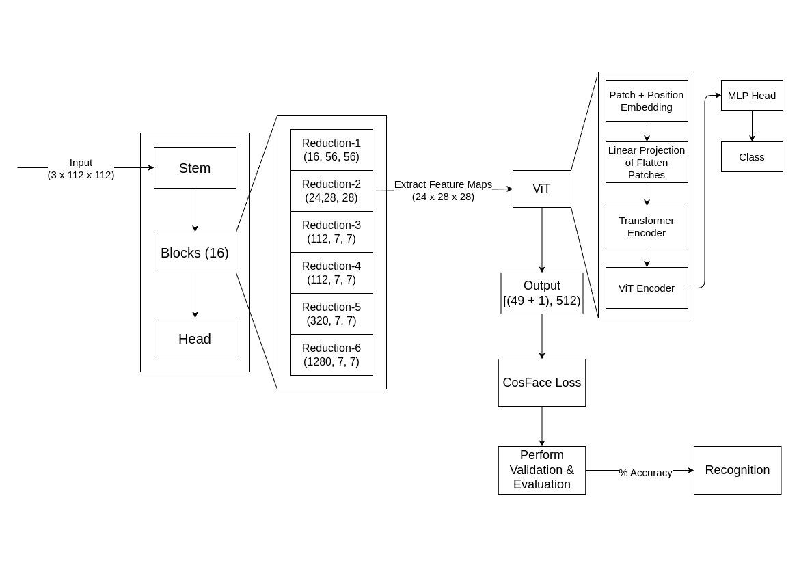

# Face Transformer - Rethinking model incorporating EfficientNet into ViT

Recently there has been great interests of Transformer not only in **NLP** but also in **Computer Vision (CV)**. We wonder if transformer can be used in face recognition by incorporating EfficientNet into ViT and whether it is better than **CNNs**. Therefore, we investigate the performance of Transformer models in face recognition. The models are trained on a large scale face recognition database **`Casia-Webface`** and evaluated on several mainstream benchmarks, including **`LFW`**, **`SLLFW`**, **`CALFW`**, **`CPLFW`**, **`TALFW`**, **`CFP-FP`** & **`AGEDB`** databases. We demonstrate that Transformer models achieve comparable performance as **CNN** with similar number of parameters and **MACs**. The Face-Transformer mainly uses **ViT (Vision Transformer)** architecture. Now we demonstrate if we can **transfer learn and fine-tune** the model with **EfficientNet** & merge it into **ViT** to get a better results.


## Objectives

- To learn a representation of face images that is invariant to variations in lighting, pose, and expression.

- To achieve state-of-the-art results on face recognition benchmarks by **fine-tuning with EfficientNet and introduce the
  model into ViT**.

- To be robust to variations in the quality of the input images by evaluating `LFW`, `SLLFW`, `CALFW`, `CPLFW`, `TALFW`, `CFP-FP` & `AGEDB` evaluation databases.

- To make it efficient in terms of computational cost and memory.

## Model Architecture



## Usage Instructions

### 1. Preparation

This code is mainly adopted from [Vision Transformer][def2], [DeiT][def3] & [Face Evolve][def52]. In addition to `PyTorch` and `torchvision`, install [`vit_pytorch`][def2] by [Phil Wang][def4], [`efficientnet_pytorch`][def53] by [Luke Melas-Kyriazi][def55] & package [`timm`][def5] by [Ross Wightman][def6]. Sincerely appreciate for their contributions.

All needed Packages are found in [`requirements.txt`][def54]. Simply install all packages by:

```bash
pip install -r requirements.txt
```

Files of [`vit_pytorch`](./vit_pytorch/) folder.

```
.
├── __init__.py
├── vit.py
├── vit_face.py
└── vits_face.py
```

Files of [`util`](./util/) folder.

```
.
├── __init__.py
├── test.py
├── utils.py
└── verification.py
```

### 2. Databases

- You can download the training databases, **CASIA-Webface** (version - [casia-webface][def50]), and put it in folder `Data`.

  |      Dataset      | Baidu Netdisk | Password | Google Drive  |   Onedrive   |    Website    |    GitHub     |
  | :---------------: | :-----------: | :------: | :-----------: | :----------: | :-----------: | :-----------: |
  | `ms1m-retinaface` | [LINK][def7]  |  `4ouw`  |               | [LINK][def8] |               |               |
  |  `CASIA-Webface`  | [LINK][def9]  |          | [LINK][def10] |              |               |               |
  |     `UMDFace`     | [LINK][def11] |          | [LINK][def12] |              |               |               |
  |      `VGG2`       | [LINK][def13] |          | [LINK][def14] |              |               |               |
  |    `MS1M-IBUG`    | [LINK][def15] |          |               |              |               |               |
  |  `MS1M-ArcFace`   | [LINK][def16] |          | [LINK][def17] |              |               |               |
  | `MS1M-RetinaFace` | [LINK][def18] |  `8eb3`  | [LINK][def19] |              |               |               |
  |   `Asian-Celeb`   | [LINK][def20] |          |               |              |               |               |
  |   `Glint-Mini`    | [LINK][def21] |  `10m5`  |               |              |               |               |
  |    `Glint360K`    | [LINK][def22] |  `o3az`  |               |              |               |               |
  |    `DeepGlint`    | [LINK][def23] |          |               |              |               |               |
  |   `WebFace260M`   |               |          |               |              | [LINK][def24] |               |
  |    `IMDB-Face`    |               |          |               |              |               |               |
  |    `Celeb500k`    |               |          |               |              |               |               |
  |    `MegaFace`     | [LINK][def25] |  `5f8m`  | [LINK][def47] |              |               |               |
  |   `DigiFace-1M`   |               |          |               |              | [LINK][def26] | [LINK][def27] |

- You can download the testing databases as follows and put them in folder `eval`.

  | Dataset  | Baidu Netdisk | Password | Google Drive  |
  | :------: | :-----------: | :------: | :-----------: |
  |  `LFW`   | [LINK][def28] |  `dfj0`  | [LINK][def29] |
  | `SLLFW`  | [LINK][def30] |  `l1z6`  | [LINK][def31] |
  | `CALFW`  | [LINK][def32] |  `vvqe`  | [LINK][def33] |
  | `CPLFW`  | [LINK][def34] |  `jyp9`  | [LINK][def35] |
  | `TALFW`  | [LINK][def36] |  `izrg`  | [LINK][def37] |
  | `CFP_FP` | [LINK][def38] |  `4fem`  | [LINK][def39] |
  | `AGEDB`  | [LINK][def40] |  `rlqf`  | [LINK][def41] |

  refers to [Insightface][def42]

- #### Quick Links

  |                                  Dataset                                  | Folder | Google Drive  |    Kaggle     |
  | :-----------------------------------------------------------------------: | :----: | :-----------: | :-----------: |
  |                              `casia-webface`                              |  Data  | [LINK][def48] | [LINK][def51] |
  | `agedb_30`, `calfw`, `cfp_ff`, `cfp_fp`, `cplfw`, `lfw`, `sllfw`, `talfw` |  eval  | [LINK][def49] |               |

### 3. Train Models

- `EfficientNet + ViT`

  ```bash
  CUDA_VISIBLE_DEVICES='0' python3 -u train.py -b <batch_size> -w 0 -d casia -n <network_name> -head CosFace --outdir <path_to_model> --warmup-epochs 0 --lr 3e-5 -r <path_to_model>
  ```

### 4. Pretrained Models and Test Models (on LFW, SLLFW, CALFW, CPLFW, TALFW, CFP_FP, AGEDB)

#### You can download the following models -

|        Model         | Google Drive  |
| :------------------: | :-----------: |
|      `ViT-P8S8`      | [LINK][def44] |
| `EfficientNet + ViT` | [LINK][def46] |

#### You can test Models -

The content of [`property`][def56] file for [`casia-webface`][def57] dataset is as follows: $10572, 112, 112$

```bash
python3 test.py --model <path_to_model> --network <network_name> --batch_size <batch_size> --target <eval_data>
```

## References

This is the research paper of Face Transformer for Recognition [[LINK]][def], forked from [`zhongyy/Face-Transformer`][def1].

[def]: https://arxiv.org/abs/2103.14803
[def1]: https://github.com/zhongyy/Face-Transformer
[def2]: https://github.com/lucidrains/vit-pytorch
[def3]: https://github.com/facebookresearch/deit
[def4]: https://github.com/lucidrains
[def5]: https://github.com/rwightman/pytorch-image-models
[def6]: https://github.com/rwightman
[def7]: https://pan.baidu.com/s/14z7qbi0K8aAYDcgT4ArnWg
[def8]: https://1drv.ms/u/s!AswpsDO2toNKrjhJhMRoxr-HlECx?e=VSXTmv
[def9]: https://pan.baidu.com/s/1AfHdPsxJZBD8kBJeIhmq1w
[def10]: https://drive.google.com/file/d/1KxNCrXzln0lal3N4JiYl9cFOIhT78y1l/view?usp=sharing
[def11]: https://pan.baidu.com/s/1aGutJwNWpV-lA0f_7eNsGQ
[def12]: https://drive.google.com/file/d/1azhEHoJjVmifuzBVKJwl-sDbLZ-Wzp4O/view?usp=sharing
[def13]: https://pan.baidu.com/s/1c3KeLzy
[def14]: https://drive.google.com/file/d/1dyVQ7X3d28eAcjV3s3o0MT-HyODp_v3R/view?usp=sharing
[def15]: https://pan.baidu.com/s/1nxmSCch
[def16]: https://pan.baidu.com/s/1S6LJZGdqcZRle1vlcMzHOQ
[def17]: https://drive.google.com/file/d/1SXS4-Am3bsKSK615qbYdbA_FMVh3sAvR/view?usp=sharing
[def18]: https://pan.baidu.com/s/1RBnaW88PC6cKqtYwgfVX8Q
[def19]: https://drive.google.com/file/d/1JgmzL9OLTqDAZE86pBgETtSQL4USKTFy/view?usp=sharing
[def20]: https://pan.baidu.com/s/12wSgofDy1flFf6lOyAxJRg
[def21]: https://pan.baidu.com/s/10IzEyP-Z9dWFcxxj9jdJpQ
[def22]: https://pan.baidu.com/s/1GsYqTTt7_Dn8BfxxsLFN0w
[def23]: https://pan.baidu.com/s/1yApUbklBgRgOyOV4o3J8Eg
[def24]: https://www.face-benchmark.org/download.html
[def25]: https://drive.google.com/file/d/1O4FxijSXoEIe6fLfOocqF4VFMh5B4d89/view?usp=sharing
[def26]: https://microsoft.github.io/DigiFace1M/
[def27]: https://github.com/microsoft/DigiFace1M
[def28]: https://pan.baidu.com/s/1WwFA1lS1_6elleu6kxMGDQ
[def29]: https://drive.google.com/file/d/17ICjkR3EB8IE-PeoPZRYqYOcFhuaWqar/view?usp=sharing
[def30]: https://pan.baidu.com/s/19lb0f9ZkAunKDpTzhJQUag
[def31]: https://drive.google.com/file/d/1oJZb-8jcJqAfXpg62bzGWpkHeabiqO0Q/view?usp=sharing
[def32]: https://pan.baidu.com/s/1QyjRZNE0chm9BmobE2iOHQ
[def33]: https://drive.google.com/file/d/1KRPCobKoVA3MLGqvW6zbOqTZ3lVK3ysD/view?usp=sharing
[def34]: https://pan.baidu.com/s/1ZmnIBu1IwBq6pPBGByxeyw
[def35]: https://drive.google.com/file/d/1IhIChTARWvZwoV0H4khHhNGFs7BdioBG/view?usp=sharing
[def36]: https://pan.baidu.com/s/1p-qhd2IdV9Gx6F6WaPhe5Q
[def37]: https://drive.google.com/file/d/1hNNi3iz_w0MtYD1vvLDz4Ieq7tzkSQ82/view?usp=sharing
[def38]: https://pan.baidu.com/s/1lID0Oe9zE6RvlAdhtBlP1w
[def39]: https://drive.google.com/file/d/13MPwlCqjiO6OqZWQkyHl0CjcJa4UEnEy/view?usp=sharing
[def40]: https://pan.baidu.com/s/1vf08K1C5CSF4w0YpF5KEww
[def41]: https://drive.google.com/file/d/15el0xh5E6tSYJQ1KurAGgfggNjqg_t6d/view?usp=sharing
[def42]: https://github.com/deepinsight/insightface/
[def43]: https://pan.baidu.com/s/1ppgQe1GG3oa2-uz2zzL6EQ
[def44]: https://drive.google.com/drive/folders/1U7MDZSS38cMIvtEWohaLAH4j7JgBNy0T?usp=sharing
[def45]: https://pan.baidu.com/s/1VrDfvz4SvYVnPcTlHVKAkg
[def46]: https://drive.google.com/drive/folders/1-LlwwBCwkWYL5NBs_aZPsyA2GSwpMro6?usp=sharing
[def47]: https://drive.google.com/file/d/1O4FxijSXoEIe6fLfOocqF4VFMh5B4d89/view?usp=sharing
[def48]: https://drive.google.com/drive/folders/1XIY6mNmpmofo0KaEZB21PTorRTI0pypB?usp=sharing
[def49]: https://drive.google.com/drive/folders/1AfEbWCB1cZCfUJI_vgznNnMO3d0YVP-W?usp=sharing
[def50]: https://drive.google.com/file/d/1KxNCrXzln0lal3N4JiYl9cFOIhT78y1l/view
[def51]: https://www.kaggle.com/datasets/debarghamitraroy/casia-webface
[def52]: https://github.com/ZhaoJ9014/face.evoLVe
[def53]: https://github.com/lukemelas/EfficientNet-PyTorch
[def54]: ./requirements.txt
[def55]: https://github.com/lukemelas
[def56]: ./Data/casia-webface/property
[def57]: ./Data/casia-webface/
